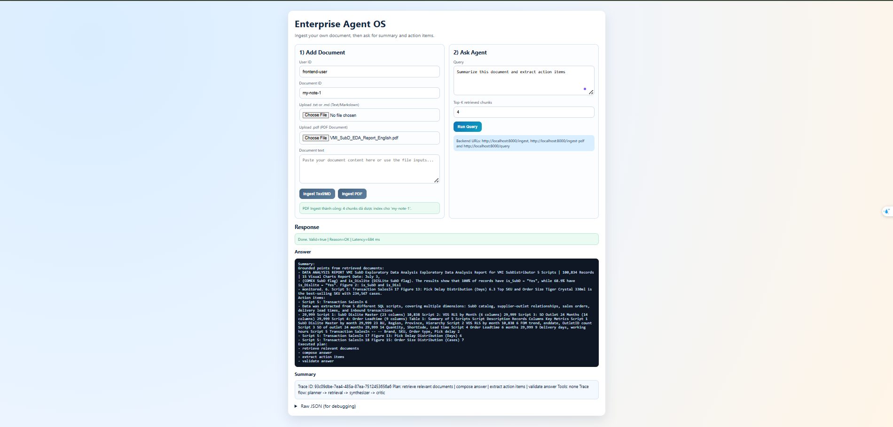
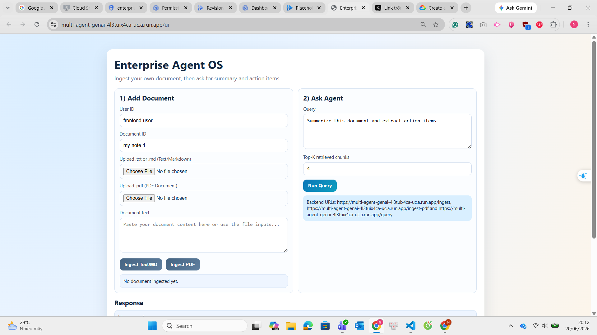

# Local-First Multi-Agent GenAI Platform

Production-style multi-agent AI system with:

- FastAPI gateway
- LangGraph orchestration
- RAG retrieval pipeline
- Tool execution framework (document/sql/python/web)
- Critic agent for validation
- Structured tracing, logs, metrics, and eval runner

## 1) Quick Start

### Option A: Using venv (Windows)

```powershell
cd e:\multi-agent-genai
C:/Python313/python.exe -m venv .venv
.\.venv\Scripts\Activate.ps1
python -m pip install --upgrade pip
pip install -r requirements.txt
python data/init_db.py
python -m uvicorn api.main:app --reload --port 8000
```

### Option B: Using Conda (cross-platform)

```bash
conda create -n multi-genai python=3.11 -y
conda activate multi-genai
python -m pip install --upgrade pip
pip install -r requirements.txt
python data/init_db.py
python -m uvicorn api.main:app --reload --port 8000
```

Open UI in browser:

```powershell
start http://127.0.0.1:8000/ui
```

Use UI flow:

1. In **Add Document**, paste text (or upload `.txt`/`.md`) and click **Ingest Document**.
2. In **Ask Agent**, enter your prompt and click **Run Query**.
3. Read the friendly **Answer** and **Summary** panels; expand **Raw JSON** only when debugging.

Health check:

```powershell
curl http://127.0.0.1:8000/health
```

Compatibility health route:

```powershell
curl http://127.0.0.1:8000/api/health
```

Query:

```powershell
Invoke-RestMethod -Uri "http://127.0.0.1:8000/query" -Method Post -ContentType "application/json" -Body '{"user_id":"123","query":"Summarize this document and extract action items","top_k":4}'
```

Compatibility query route also works:

```powershell
Invoke-RestMethod -Uri "http://127.0.0.1:8000/api/query" -Method Post -ContentType "application/json" -Body '{"user_id":"123","query":"Summarize this document and extract action items","top_k":4}'
```

Tip:

- `http://127.0.0.1:8000` returns service JSON metadata.
- `http://127.0.0.1:8000/ui` is the interactive web UI.
- UI sends data to `/ingest` and `/query` on the same server origin.

## 2) Project Structure

```text
project/
├── api/
├── agents/
├── tools/
├── rag/
├── eval/
├── data/
├── logs/
├── docker/
└── frontend/
```

## 3) Design Notes

- Local-first LLM via Ollama (`OLLAMA_BASE_URL`, `OLLAMA_MODEL`)
- Graceful fallback behavior when Ollama is unavailable
- SQLite for structured data and local persistence
- Local JSON vector store for zero-cost RAG
- Critic node validates quality and triggers one retry path

## 4) User Interface

### Local UI

The **Enterprise Agent OS** interface provides a clean, intuitive two-panel design:



**Left Panel - Add Document:**
- **User ID**: Identify document owner
- **Document ID**: Unique identifier for tracking
- **Upload Options**: Support for `.txt` and `.md` text files, or direct PDF upload
- **Document Text**: Paste content directly or use file inputs
- **Action Buttons**: Separate buttons for ingesting text and PDF documents

**Right Panel - Ask Agent:**
- **Query Input**: Enter natural language questions or prompts
- **Top-K Setting**: Control number of retrieved document chunks (default: 4)
- **Run Query Button**: Execute the agent pipeline
- **Response Area**: Displays:
  - **Answer**: Direct response from the agent
  - **Summary**: Extracted key points and action items
  - **Raw JSON**: Full debug information and trace data

**Response Section:**
- Green status bar showing query completion
- Structured output with parsed answers and summaries
- Expandable JSON for troubleshooting

### Deployed UI

The same interface is available when deployed to cloud platforms:



Features remain consistent across local and cloud deployments:
- Same workflow and component layout
- Multi-agent orchestration powered by LangGraph
- Real-time response with streaming support
- Full access to document ingestion and querying capabilities

## 5) Testing & Eval

Run tests:

```powershell
pytest -q
```

Run evaluation dataset:

```powershell
python eval/run_eval.py
```

Run no-server demo:

```powershell
python run_demo.py
```
